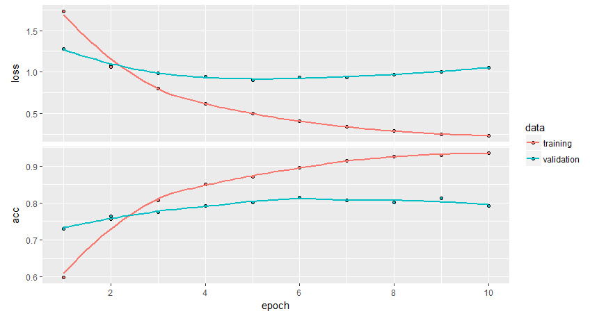

```{r setup, include=FALSE}
knitr::opts_chunk$set(echo = TRUE)
```

## P1
I add one more hidden layer and icrease the batch size to $128$, epochs to $10$. The final prediction evaluation is:
```{r, eval=F}
Test score: 1.044557 
Test accuracy 0.7920748
```
 The old one's evaluation is:
```{r, eval=F}
Test score: 0.8894484 
Test accuracy 0.7894034
```

The hist plot for new model is:


## P2
I read through the detail and run the R file. The model has 2 fully connectd hidden layers. The ouput is:
```{r, eval=F}
Step 100: loss = 2.17 (0.004 sec)
Step 200: loss = 1.98 (0.004 sec)
Step 300: loss = 1.70 (0.004 sec)
Step 400: loss = 1.49 (0.004 sec)
Step 500: loss = 1.02 (0.004 sec)
Step 600: loss = 0.87 (0.004 sec)
Step 700: loss = 0.63 (0.004 sec)
Step 800: loss = 0.53 (0.004 sec)
Step 900: loss = 0.44 (0.004 sec)
Training Data Eval:
  Num examples: 55000  Num correct: 47309  Precision @ 1: 0.8602
Validation Data Eval:
  Num examples: 5000  Num correct: 4360  Precision @ 1: 0.8720
Test Data Eval:
  Num examples: 10000  Num correct: 8696  Precision @ 1: 0.8696
Step 1000: loss = 0.55 (0.007 sec)
Step 1100: loss = 0.60 (0.004 sec)
Step 1200: loss = 0.45 (0.004 sec)
Step 1300: loss = 0.50 (0.004 sec)
Step 1400: loss = 0.41 (0.003 sec)
Step 1500: loss = 0.42 (0.004 sec)
Step 1600: loss = 0.37 (0.004 sec)
Step 1700: loss = 0.30 (0.004 sec)
Step 1800: loss = 0.40 (0.004 sec)
Step 1900: loss = 0.40 (0.004 sec)
Training Data Eval:
  Num examples: 55000  Num correct: 49334  Precision @ 1: 0.8970
Validation Data Eval:
  Num examples: 5000  Num correct: 4520  Precision @ 1: 0.9040
Test Data Eval:
  Num examples: 10000  Num correct: 9011  Precision @ 1: 0.9011
Step 2000: loss = 0.44 (0.003 sec)
Step 2100: loss = 0.41 (0.004 sec)
Step 2200: loss = 0.38 (0.004 sec)
Step 2300: loss = 0.30 (0.005 sec)
Step 2400: loss = 0.24 (0.004 sec)
Step 2500: loss = 0.46 (0.004 sec)
Step 2600: loss = 0.22 (0.004 sec)
Step 2700: loss = 0.36 (0.004 sec)
Step 2800: loss = 0.35 (0.004 sec)
Step 2900: loss = 0.21 (0.004 sec)
Training Data Eval:
  Num examples: 55000  Num correct: 49950  Precision @ 1: 0.9082
Validation Data Eval:
  Num examples: 5000  Num correct: 4584  Precision @ 1: 0.9168
Test Data Eval:
  Num examples: 10000  Num correct: 9141  Precision @ 1: 0.9141
Step 3000: loss = 0.34 (0.004 sec)
Step 3100: loss = 0.29 (0.004 sec)
Step 3200: loss = 0.19 (0.004 sec)
Step 3300: loss = 0.22 (0.004 sec)
Step 3400: loss = 0.30 (0.004 sec)
Step 3500: loss = 0.25 (0.004 sec)
Step 3600: loss = 0.25 (0.004 sec)
Step 3700: loss = 0.17 (0.004 sec)
Step 3800: loss = 0.26 (0.004 sec)
Step 3900: loss = 0.25 (0.004 sec)
Training Data Eval:
  Num examples: 55000  Num correct: 50412  Precision @ 1: 0.9166
Validation Data Eval:
  Num examples: 5000  Num correct: 4622  Precision @ 1: 0.9244
Test Data Eval:
  Num examples: 10000  Num correct: 9198  Precision @ 1: 0.9198
Step 4000: loss = 0.16 (0.004 sec)
Step 4100: loss = 0.24 (0.004 sec)
Step 4200: loss = 0.19 (0.005 sec)
Step 4300: loss = 0.24 (0.004 sec)
Step 4400: loss = 0.33 (0.004 sec)
Step 4500: loss = 0.19 (0.004 sec)
Step 4600: loss = 0.41 (0.004 sec)
Step 4700: loss = 0.30 (0.004 sec)
Step 4800: loss = 0.29 (0.003 sec)
Step 4900: loss = 0.26 (0.004 sec)
Training Data Eval:
  Num examples: 55000  Num correct: 50862  Precision @ 1: 0.9248
Validation Data Eval:
  Num examples: 5000  Num correct: 4663  Precision @ 1: 0.9326
Test Data Eval:
  Num examples: 10000  Num correct: 9284  Precision @ 1: 0.9284
Step 5000: loss = 0.21 (0.004 sec)
```


