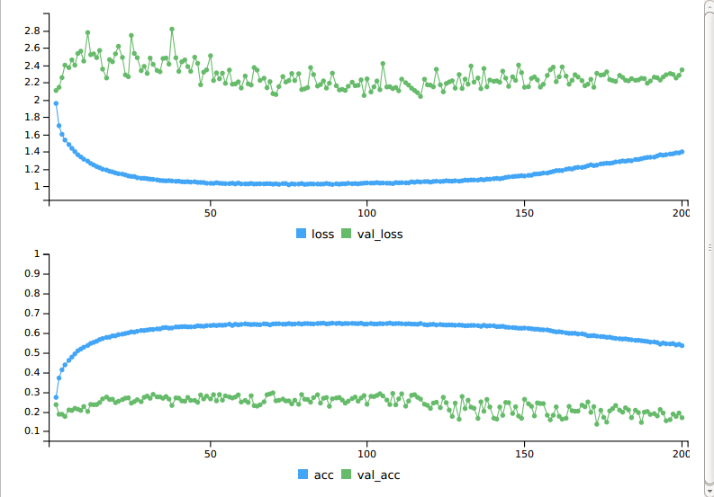

```{r setup, include=FALSE}
knitr::opts_chunk$set(echo = TRUE)
```

## P1
The original one have 200 folds which makes the training time extreme lone (in my desktop, I used a GTX1070 for computing and it takes more than 1 hour to finish). The accuracy plot through training is shown below:


The accuracy for the test set is:
```
> evaluate(model,x_test,y_test)
10000/10000 [==============================] - 1s 65us/step
$loss
[1] 2.300075

$acc
[1] 0.1692
```

For improvement, inspired by the original pyhton code, I change the data generator to be:
```{python,eval=F}
datagen = ImageDataGenerator(
        featurewise_center=False,  # set input mean to 0 over the dataset
        samplewise_center=False,  # set each sample mean to 0
        featurewise_std_normalization=False,  # divide inputs by std of the dataset
        samplewise_std_normalization=False,  # divide each input by its std
        zca_whitening=False,  # apply ZCA whitening
        rotation_range=0,  # randomly rotate images in the range (degrees, 0 to 180)
        width_shift_range=0.1,  # randomly shift images horizontally (fraction of total width)
        height_shift_range=0.1,  # randomly shift images vertically (fraction of total height)
        horizontal_flip=True,  # randomly flip images
        vertical_flip=False)  # randomly flip images
```

Also, change the cycle to 20 to save time. The final results are:
```
10000/10000 [==============================] - 2s 188us/step
Test loss: 0.9569222185134888
Test accuracy: 0.6608
```

## P2

The old model has performance:
```
Test score: 0.3541813684940338
Test accuracy: 0.8540799934864044
```
To improve the accuracy, I increase the batch size to `150`. Also, I add two 
fully connect layers before the `LSTM` and one after `LSTM`. The final accuracy is :
```
Test score: 0.33275314164161685
Test accuracy: 0.8547200020551682
```

## P3

This example redo the TensorFlow Mechanics 101. It builds a NN having two fully 
connect hidden layers. The R code have the resul:
```
Step 100: loss = 2.14 (0.003 sec)
Step 200: loss = 1.93 (0.004 sec)
Step 300: loss = 1.68 (0.004 sec)
Step 400: loss = 1.28 (0.004 sec)
Step 500: loss = 0.91 (0.003 sec)
Step 600: loss = 0.78 (0.004 sec)
Step 700: loss = 0.68 (0.003 sec)
Step 800: loss = 0.62 (0.004 sec)
Step 900: loss = 0.51 (0.004 sec)
Training Data Eval:
  Num examples: 55000  Num correct: 47172  Precision @ 1: 0.8577
Validation Data Eval:
  Num examples: 5000  Num correct: 4328  Precision @ 1: 0.8656
Test Data Eval:
  Num examples: 10000  Num correct: 8644  Precision @ 1: 0.8644
Step 1000: loss = 0.37 (0.004 sec)
Step 1100: loss = 0.40 (0.003 sec)
Step 1200: loss = 0.42 (0.004 sec)
Step 1300: loss = 0.50 (0.004 sec)
Step 1400: loss = 0.40 (0.004 sec)
Step 1500: loss = 0.43 (0.004 sec)
Step 1600: loss = 0.37 (0.003 sec)
Step 1700: loss = 0.55 (0.004 sec)
Step 1800: loss = 0.46 (0.004 sec)
Step 1900: loss = 0.48 (0.006 sec)
Training Data Eval:
  Num examples: 55000  Num correct: 49105  Precision @ 1: 0.8928
Validation Data Eval:
  Num examples: 5000  Num correct: 4483  Precision @ 1: 0.8966
Test Data Eval:
  Num examples: 10000  Num correct: 8975  Precision @ 1: 0.8975
Step 2000: loss = 0.26 (0.005 sec)
Step 2100: loss = 0.35 (0.005 sec)
Step 2200: loss = 0.48 (0.004 sec)
Step 2300: loss = 0.21 (0.004 sec)
Step 2400: loss = 0.52 (0.009 sec)
Step 2500: loss = 0.38 (0.015 sec)
Step 2600: loss = 0.29 (0.005 sec)
Step 2700: loss = 0.32 (0.005 sec)
Step 2800: loss = 0.30 (0.004 sec)
Step 2900: loss = 0.24 (0.004 sec)
Training Data Eval:
  Num examples: 55000  Num correct: 49749  Precision @ 1: 0.9045
Validation Data Eval:
  Num examples: 5000  Num correct: 4564  Precision @ 1: 0.9128
Test Data Eval:
  Num examples: 10000  Num correct: 9108  Precision @ 1: 0.9108
Step 3000: loss = 0.35 (0.003 sec)
Step 3100: loss = 0.38 (0.003 sec)
Step 3200: loss = 0.29 (0.004 sec)
Step 3300: loss = 0.23 (0.003 sec)
Step 3400: loss = 0.28 (0.004 sec)
Step 3500: loss = 0.32 (0.004 sec)
Step 3600: loss = 0.41 (0.003 sec)
Step 3700: loss = 0.56 (0.004 sec)
Step 3800: loss = 0.41 (0.004 sec)
Step 3900: loss = 0.37 (0.004 sec)
Training Data Eval:
  Num examples: 55000  Num correct: 50348  Precision @ 1: 0.9154
Validation Data Eval:
  Num examples: 5000  Num correct: 4606  Precision @ 1: 0.9212
Test Data Eval:
  Num examples: 10000  Num correct: 9189  Precision @ 1: 0.9189
Step 4000: loss = 0.20 (0.004 sec)
Step 4100: loss = 0.37 (0.004 sec)
Step 4200: loss = 0.33 (0.005 sec)
Step 4300: loss = 0.38 (0.005 sec)
Step 4400: loss = 0.23 (0.003 sec)
Step 4500: loss = 0.19 (0.003 sec)
Step 4600: loss = 0.11 (0.004 sec)
Step 4700: loss = 0.24 (0.003 sec)
Step 4800: loss = 0.31 (0.003 sec)
Step 4900: loss = 0.27 (0.004 sec)
Training Data Eval:
  Num examples: 55000  Num correct: 50744  Precision @ 1: 0.9226
Validation Data Eval:
  Num examples: 5000  Num correct: 4644  Precision @ 1: 0.9288
Test Data Eval:
  Num examples: 10000  Num correct: 9258  Precision @ 1: 0.9258
Step 5000: loss = 0.33 (0.003 sec)
```
